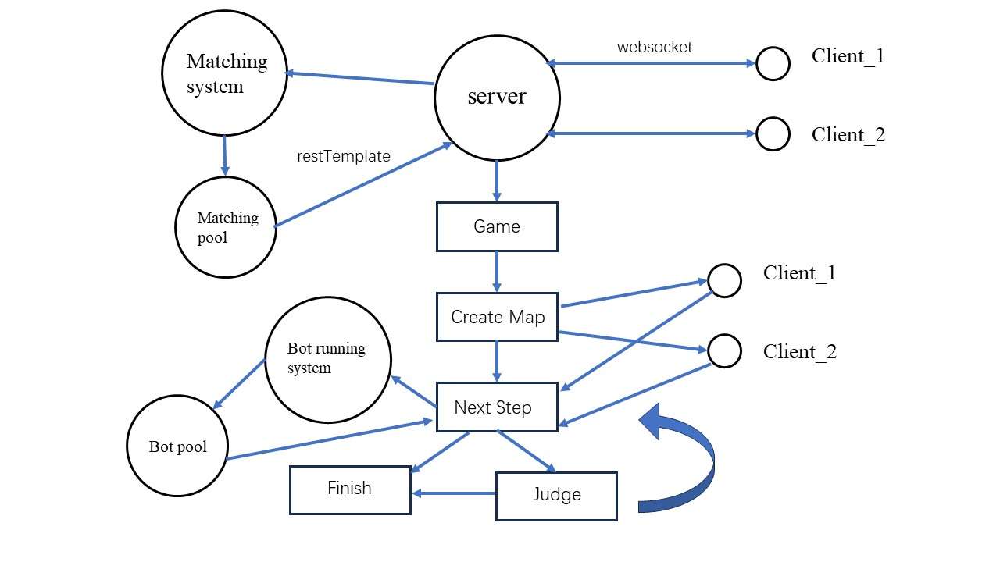

## README

### Overview

We are all quite familiar with Snake (Video Game) where the player maneuvers the end of a growing line, the snake. The player must keep the snake from colliding with both obstacles and itself. You may think it too ancient. But this is what this project aims to do - adding more fun to this old but classic game.

In this project, you can play Snake with your friends. Each time you can play with only one component. Don't let the head of your snake hit the obstacles, your opponent and yourself. Besides, you can also implement your own bot to battle with others for you. Let's see who is the real king of snakes.

You can see the main structure of the project in the picture shown below:



### Features

+ **Support two-player online battle.** You can use your bot or battle in person
+ **Game Replay**. After login, you can access replays of all the past battles
+ **Creating you own bots**. You can create your own bot to fight for you. Try to use your AI knowledge to create the king of bots

### How to use it

1. Visit this [url]([app2079.acapp.acwing.com.cn/](https://app2079.acapp.acwing.com.cn/)) (Note: this is a temporary url, subject to change)
2. register your own account with your username and password
3. In battle page, choose your bot or battle in person, then press start matching button
4. If you choose to battle in person, use WASD to control the direction of your snake. Remember you only have 5 seconds to determine
5. You may also write your own bot. Currently we only accept Java code.

### How to create your own bot

To run your bot, you must implement the `Integer nextMove(String input)` method, where:

+ parameter: `input` is the information encoded.

  + ```
    _______#________#________#(__________)#_________#_______#(_________)
     map       me.sx    me.sy    me.op       you.sx    you.sy   you.op
    ```

  + `input` contains only integer, ( and # sign. The first part is the encoded map

    + size: 13$\times$14, 1 represents obstacle

    the next two parts are the initial x and y position of your snake

    Then the string in the parentheses is your operation list (0: up; 1: right; 2: down: 3: left)

    Similarly, the rest are those of your opponent

+ return value: an Integer, representing the direction of your snake for the next round

Example:

```java
// This bot only find the next valid position

package com.kob.botrunningsystem.utils;

import java.io.File;
import java.io.FileNotFoundException;
import java.util.ArrayList;
import java.util.List;
import java.util.Scanner;

public class Bot implements java.util.function.Supplier<Integer> {
  static class Cell {
    public int x, y;
    public Cell(int x, int y) {
      this.x = x;
      this.y = y;
    }
  }
  private boolean check_tail_increasing(int steps) {
    if (steps <= 10) return true;
    return steps % 3 == 1;
  }
  public List<Cell> getCells(int sx, int sy, String steps) {
    steps = steps.substring(1, steps.length() - 1);
    List<Cell> res = new ArrayList<>();

    int[] dx = {-1, 0, 1, 0}, dy = {0, 1, 0, -1};
    int x = sx, y = sy;
    res.add(new Cell(x, y));
    int step = 0;
    for (int i = 0; i < steps.length(); i ++) {
      int d = steps.charAt(i) - '0';
      x += dx[d];
      y += dy[d];
      res.add(new Cell(x, y));
      if (!check_tail_increasing(++ step)) {
        res.remove(0);
      }
    }
    return res;
  }
  public Integer nextMove(String input) {
    String[] strs = input.split("#");
    int[][] g = new int[13][14];
    for (int i = 0, k = 0; i < 13; i ++) {
      for (int j = 0; j < 14; j ++, k ++) {
        if (strs[0].charAt(k) == '1') {
          g[i][j] = 1;
        }
      }
    }
    int aSx = Integer.parseInt(strs[1]), aSy = Integer.parseInt(strs[2]);
    int bSx = Integer.parseInt(strs[4]), bSy = Integer.parseInt(strs[5]);

    List<Cell> aCells = getCells(aSx, aSy, strs[3]);
    List<Cell> bCells = getCells(bSx, bSy, strs[6]);

    for (Cell c : aCells) g[c.x][c.y] = 1;
    for (Cell c : bCells) g[c.x][c.y] = 1;

    int[] dx = {-1, 0, 1, 0}, dy = {0, 1, 0, -1};
    for (int i = 0; i < 4; i ++) {
      int x = aCells.get(aCells.size() - 1).x + dx[i];
      int y = aCells.get(aCells.size() - 1).y + dy[i];
      if (x >= 0 && x < 13 && y >= 0 && y < 14 && g[x][y] == 0) {
        return i;
      }
    }
    return 0;
  }

  @Override
  public Integer get() {
    File file = new File("input.txt");
    try {
      Scanner sc = new Scanner(file);
      return nextMove(sc.next());
    } catch (FileNotFoundException e) {
      throw new RuntimeException(e);
    }
  }
}

```

